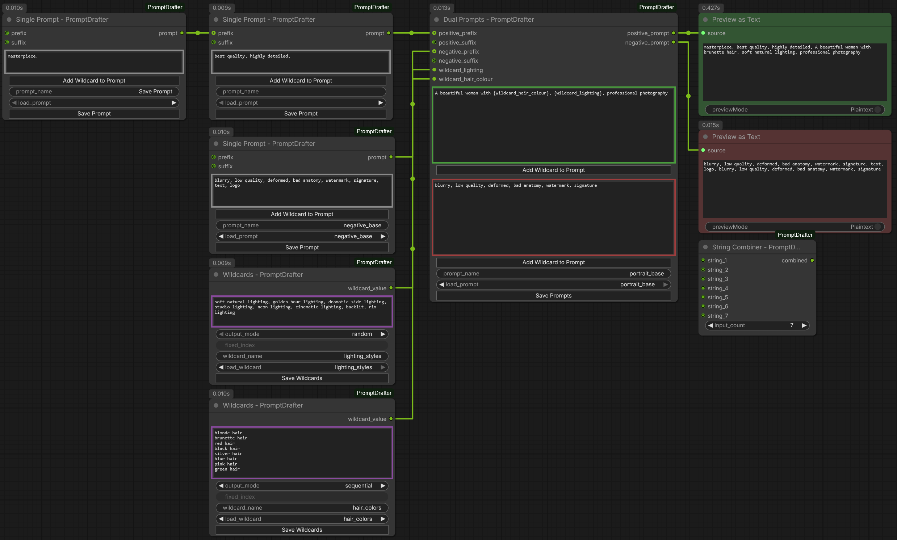

# ComfyUI-PromptDrafter

A custom node pack for ComfyUI that provides an intuitive prompt drafting, saving, loading and management system with wildcard support.


## Overview



## Features

- **Dual Prompt Drafter**: Main node with separate positive (green) and negative (red) prompt fields
- **Single Prompt Drafter**: Flexible single prompt field (silver) for either positive or negative use
- **Wildcard Node**: Create and manage wildcard value lists with multiple output modes
- **Prompt Combiner**: Combine multiple strings with smart comma handling (up to 25 inputs)
- **Dynamic Wildcard Ports**: Automatically creates input ports based on `{wildcard_name}` patterns in your text
- **Save/Load System**: Save and load prompt combinations and wildcards as JSON files
- **Add Wildcard Buttons**: Convenient buttons to insert numbered wildcard placeholders (`{wildcard_01}`, `{wildcard_02}`, etc.)
- **Prefix/Suffix Support**: Chain prompts together with optional prefix and suffix inputs
- **Smart Comma Handling**: Automatically ensures proper `, ` separation without double commas

## Installation

### Method 1: Clone Repository

```bash
cd ComfyUI/custom_nodes
git clone https://github.com/Carasibana/ComfyUI-PromptDrafter.git
```

### Method 2: Manual Download

1. Download the repository as a ZIP file
2. Extract to `ComfyUI/custom_nodes/ComfyUI-PromptDrafter`
3. Restart ComfyUI

## Nodes

### Dual Prompts - PromptDrafter

The main node for creating prompt combinations with both positive and negative prompts.

**Inputs:**
- `positive_prompt` (text): Your positive prompt with green border
  - "Add Wildcard to Prompt" button below to insert numbered wildcards
- `negative_prompt` (text): Your negative prompt with red border
  - "Add Wildcard to Prompt" button below to insert numbered wildcards
- `positive_prefix` (optional string): Text to prepend to positive prompt
- `positive_suffix` (optional string): Text to append to positive prompt
- `negative_prefix` (optional string): Text to prepend to negative prompt
- `negative_suffix` (optional string): Text to append to negative prompt
- `prompt_name` (string): Name for saving/loading
- `load_prompt` (dropdown): Select a saved prompt to load
- Dynamic `wildcard_*` inputs: Automatically created based on wildcards in your text

**Outputs:**
- `positive_prompt` (string): Processed positive prompt
- `negative_prompt` (string): Processed negative prompt

### Single Prompt - PromptDrafter

A flexible single prompt node that can be used for either positive or negative prompts.

**Inputs:**
- `prompt` (text): Your prompt with silver/neutral border
  - "Add Wildcard to Prompt" button below to insert numbered wildcards
- `prefix` (optional string): Text to prepend
- `suffix` (optional string): Text to append
- `prompt_name` (string): Name for saving/loading
- `load_prompt` (dropdown): Select a saved prompt to load
- Dynamic `wildcard_*` inputs: Automatically created based on wildcards in your text

**Outputs:**
- `prompt` (string): Processed prompt

### Wildcards - PromptDrafter

Create and manage lists of values that can be randomly or sequentially selected.

**Inputs:**
- `wildcard_values` (text): Values separated by newline, comma, or `|`
- `output_mode` (dropdown): How to select/output values
  - `random`: Randomly select one value
  - `sequential`: Cycle through values in order
  - `fixed`: Use a specific index
  - `dynamic_prompts`: Output in `{opt1|opt2|opt3}` format for Dynamic Prompts compatibility
  - `list (csv)`: Output as comma-separated list
- `fixed_index` (int): Index to use when mode is "fixed"
- `wildcard_name` (string): Name for saving/loading
- `load_wildcard` (dropdown): Select a saved wildcard to load

**Outputs:**
- `wildcard_value` (string): The selected or formatted value

### String Combiner - PromptDrafter

A utility node for combining multiple strings with smart comma handling. Perfect for building complex prompts from multiple sources.

**Inputs:**
- `input_count` (int): Number of inputs to show (2-25, default: 2)
- `string_1` through `string_25` (optional strings): Strings to combine
  - Only the number of inputs specified by `input_count` are visible

**Outputs:**
- `combined` (string): All non-empty inputs combined with `, ` separator

**Features:**
- **Smart comma handling**: Automatically adds `, ` between parts without creating double commas
- **Flexible input count**: Show only the inputs you need (2-25)
- **Ignores empty inputs**: Blank or unconnected inputs are skipped
- **Clean output**: No trailing commas or extra spaces

**Example:**
- Input 1: `"masterpiece, best quality,"`
- Input 2: `"portrait of a woman"`
- Input 3: `", detailed eyes"`
- Output: `"masterpiece, best quality, portrait of a woman, detailed eyes"`

## Wildcards

### Using Wildcards in Prompts

Type `{wildcard_name}` anywhere in your prompt text to create a wildcard placeholder. The node will automatically create an input port named `wildcard_name` that you can connect to a Wildcard node.

**Example:**
```
masterpiece, best quality, {wildcard_subject}, {wildcard_lighting}
```

This creates two input ports: `wildcard_subject` and `wildcard_lighting`.

### Wildcard Value Formats

The Wildcard node accepts values in multiple formats:

**Newline separated:**
```
blonde hair
brunette hair
red hair
```

**Comma separated:**
```
blonde hair, brunette hair, red hair
```

**Pipe separated:**
```
blonde hair | brunette hair | red hair
```

### Grouping Values

Use parentheses `()` or curly braces `{}` to group values that contain delimiters:

```
(red, green), blue, orange
```
Results in: `["(red, green)", "blue", "orange"]`

```
{warm|cool}, neutral, {bright|dark}
```
Results in: `["{warm|cool}", "neutral", "{bright|dark}"]`

This is useful for creating nested wildcard lists or preserving Dynamic Prompts syntax within values.

## Save/Load System

### Saving Prompts

1. Enter a name in the `prompt_name` field
2. Click the "Save Prompt" button
3. The prompt is saved as a JSON file in the `saved/` folder

### Loading Prompts

1. Select a prompt from the `load_prompt` dropdown
2. The prompt text fields will be populated with the saved values

### File Locations

Saved files are stored in:
- `saved/dual_prompts/` - Dual prompt combinations
- `saved/single_prompts/` - Single prompts
- `saved/wildcards/` - Wildcard lists

### Configuration

Edit `config.json` to customize save paths:

```json
{
    "save_paths": {
        "dual_prompts": "saved/dual_prompts",
        "single_prompts": "saved/single_prompts",
        "wildcards": "saved/wildcards"
    },
    "settings": {
        "auto_save": false,
        "default_wildcard_mode": "random"
    }
}
```

## Example Workflow

1. Add a **Dual Prompt Drafter** node
2. Type your positive prompt: `masterpiece, {wildcard_style}, {wildcard_subject}`
3. Type your negative prompt: `blurry, low quality`
4. Add two **Wildcard** nodes
5. Connect them to the automatically created `wildcard_style` and `wildcard_subject` ports
6. Fill in the wildcard values
7. Connect the outputs to your CLIP Text Encode nodes

## Included Examples

The pack comes with example saved prompts and wildcards:

**Dual Prompts:**
- `portrait_base` - Basic portrait prompt template
- `anime_style` - Anime-style prompt template

**Single Prompts:**
- `quality_tags` - Common quality boosting tags
- `negative_base` - Common negative prompt tags

**Wildcards:**
- `hair_colors` - Various hair colors
- `eye_colors` - Various eye colors
- `lighting_styles` - Different lighting setups
- `art_styles` - Various art styles

## Compatibility

- ComfyUI (latest version recommended)
- Works with Dynamic Prompts extension (use `dynamic_prompts` output mode)

## Contributing

Contributions are welcome! Please feel free to submit a Pull Request.

## License

This project is licensed under the MIT License - see the [LICENSE](LICENSE) file for details.

## Changelog

### v1.0.1
- Bugfix to hide coloured outlines around text fileds when node collapsed

### v1.0.0
- Initial release
- Dual Prompt Drafter node
- Single Prompt Drafter node
- Wildcard node with multiple output modes
- Prompt Combiner node with up to 25 inputs
- Dynamic wildcard port creation
- Smart comma handling (no double commas)
- Save/Load system
- Example prompts and wildcards

## Support

If you encounter any issues or have suggestions, please open an issue on GitHub.
